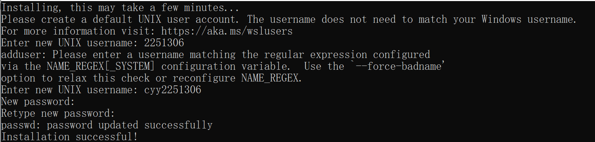
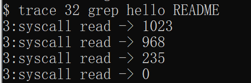
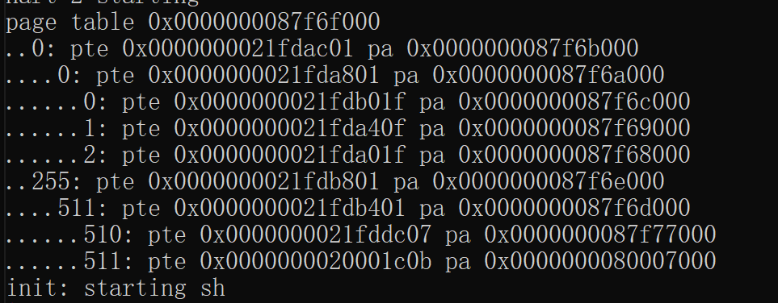

# xv6实验报告

[TOC]

github地址：https://github.com/cyyyyyeon/os-2024-7

## 环境搭建

### Tool

1. 启用“适用于 Linux 的 Windows 子系统”可选功能

`dism.exe /online /enable-feature /featurename:Microsoft-Windows-Subsystem-Linux /all /norestart`

2. 检查运行 WSL 2 的要求


3. 启用虚拟机功能

`dism.exe /online /enable-feature /featurename:VirtualMachinePlatform /all /norestart`

4. 下载 Linux 内核更新包
5. 将 WSL 2 设置为默认版本

`wsl --set-default-version 2`

6. 安装Ubuntu

` wsl --install -d Ubuntu 20.04`



7. 要安装此类所需的所有软件

`$ sudo apt-get update && sudo apt-get upgrade`

`$sudo apt-get install git build-essential gdb-multiarch qemu-system-misc gcc-riscv64-linux-gnu binutils-riscv64-linux-gnu`

遇到哈希函数错误：

解决方法，更换镜像源：

`cd /etc/apt`

`sudo mv sources.list sources.list.b `

``sudo vi sources.list`

进入后先按i

粘贴 `

```
# 默认注释了源码镜像以提高 apt update 速度，如有需要可自行取消注释
deb https://mirrors.tuna.tsinghua.edu.cn/ubuntu/ mantic main restricted universe multiverse

# deb-src https://mirrors.tuna.tsinghua.edu.cn/ubuntu/ mantic main restricted universe multiverse

deb https://mirrors.tuna.tsinghua.edu.cn/ubuntu/ mantic-updates main restricted universe multiverse

# deb-src https://mirrors.tuna.tsinghua.edu.cn/ubuntu/ mantic-updates main restricted universe multiverse

deb https://mirrors.tuna.tsinghua.edu.cn/ubuntu/ mantic-backports main restricted universe multiverse

# deb-src https://mirrors.tuna.tsinghua.edu.cn/ubuntu/ mantic-backports main restricted universe multiverse

deb http://security.ubuntu.com/ubuntu/ mantic-security main restricted universe multiverse

# deb-src http://security.ubuntu.com/ubuntu/ mantic-security main restricted universe multiverse

# 预发布软件源，不建议启用

# deb https://mirrors.tuna.tsinghua.edu.cn/ubuntu/ mantic-proposed main restricted universe multiverse

# # deb-src https://mirrors.tuna.tsinghua.edu.cn/ubuntu/ mantic-proposed main restricted universe multiverse
```

然后按下Esc键，之后输入 **:wq**（这个冒号也要输入！）再输入`sudo apt-get update`

8. 测试安装

` qemu-system-riscv64 --version`

` riscv64-linux-gnu-gcc --version`

9. 编译内核

`git clone git://github.com/mit-pdos/xv6-riscv.git`

### Guidance

- 了解指针
- 插入打印语句
- 可以使用 `make qemu` 在本地运行命令行中的脚本，记录所有控制台输出到文件中，便于搜索和查看输出
- 单步完成一些汇编代码或 检查堆栈上的变量：在一个窗口中运行make make qemu-gdb，在另一个窗口中运行gdb（或riscv64-linux-gnu-gdb），设置一个断点，然后按下'c'（继续），xv6将运行到断点
- 查看生成的 `kernel.asm` 文件，以了解编译器为内核生成的汇编代码
- 如果内核崩溃，它会打印一条错误信息，列出崩溃时程序计数器的值；你可以搜索 kernel.asm，找出崩溃时程序计数器所在的函数，也可以运行addr2line -e kernel/kernel pc-value（运行man addr2line了解详情）。如果想获得回溯信息，请使用 gdb 重新启动：在一个窗口中运行 "make qemu-gdb"，在另一个窗口中运行 gdb（或 riscv64-linux-gnu-gdb），在 panic 处设置断点（'b panic'），然后按'c'（继续）。当内核到达断点时，键入 "bt "获取回溯。
- 如果你的内核挂起（例如，由于死锁）或不能进一步执行（例如，由于在执行内核指令时发生了页面错误），你可以用gdb来找出它挂起的地方。在一个窗口中运行make qemu-gdb，在另一个窗口中运行gdb（riscv64-linux-gnu-gdb），然后按 “c”（继续）。当内核出现挂起时，在qemu-gdb窗口中按下Ctrl-C，然后输入'bt'来获得回溯。
- qemu 有一个 "监视器"，可以让你查询模拟机器的状态。键入 control-a c（"c "代表控制台）即可查看。info mem 是一条特别有用的监视器命令，可以打印页面表。你可能需要使用 cpu 命令来选择 info mem 查看哪个内核，或者用 make CPUS=1 qemu 启动 qemu，使其只有一个内核。

## 1. Lab1: Xv6 and Unix utilities

### 1.1 Boot xv6 ([easy](https://pdos.csail.mit.edu/6.828/2021/labs/guidance.html))

#### 实验目的

启动xv6，初步掌握xv6使用方法

#### 实验步骤

1. 获取实验室的 xv6 源代码并查看`util` 分支

```
$ git clone git://g.csail.mit.edu/xv6-labs-2021
$ cd xv6-labs-2021
$ git checkout util
```


2. 构建并运行xv6：

` 	make qemu`


​	如果此时输入ls，会得到一下输出：


​	输入`Ctrl -p`,输出：


​	如果需要退出`qemu`，键入 `Ctrl-a x`即可。

#### 实验中遇到的问题和解决办法

这个实验中遇到的困难主要是在配置工具时无法安装，通过更换清华源的方式解决。

#### 实验心得

通过本实验，我初步了解了 xv6 这一操作系统内核，同时也了解了 qemu 模拟器的使用方法，为之后的实验打下基础。

### 1.2 sleep ([easy](https://pdos.csail.mit.edu/6.828/2021/labs/guidance.html))

#### 实验目的

在 xv6 中实现 UNIX 程序 `sleep`；你的 `sleep` 应该根据用户指定的 tick 数暂停。tick 是由 xv6 内核定义的时间概念，即两次来自定时器芯片的中断之间的时间。你的解决方案应该放在文件 `user/sleep.c` 中。

#### 实验步骤

1. 在开始编码之前，阅读[xv6 book](https://pdos.csail.mit.edu/6.828/2021/xv6/book-riscv-rev2.pdf)的第1章，并查看`user/`中的其他程序（例如`user/echo.c`、`user/grep.c`和`user/rm.c`），了解如何获取传递命令行参数给程序。

2. 在命令行中，您可以运行以下命令来打开文件并查看其内容：`$ vim user/echo.c` 可以使用任何文本编辑器打开文件，例如 Vim、Nano、Gedit 等。在 Vim 编辑器中打开文件后，要退出并返回终端命令行界面，可以按照以下步骤操作：

   1. 如果您处于编辑模式（Insert Mode），请按下 Esc 键，以确保切换到正常模式（Normal Mode）。
   2. 在正常模式下，输入冒号（:）字符，会在命令行底部出现一个冒号提示符。
   3. 输入 `:q`，然后按下回车键，执行退出命令。
   4. 如果您对文件进行了修改并希望保存更改，输入 `:wq` 以保存更改。

   此外，还可以使用 `cat` 命令来显示文件的内容。例如，运行以下命令来查看文件内容：`cat user/echo.c` `cat` 命令会将文件的内容直接输出到终端。

   使用 less 命令：`less` 命令是一个分页查看器，用于逐页查看文件内容（使用空格键向下翻页，使用 b 键向上翻页，按下 q 键退出）。例如，运行以下命令来查看文件内容：`less user/echo.c`

3. 通过 `kernel/sysproc.c` 中的 `sys_sleep` 获取实现`sleep`系统调用的xv6内核代码

   

   通过 `user/user.h`获取可从用户程序调用`sleep`的C语言定义

   通过 `user/usys.S`获取从用户代码跳转到内核以实现`sleep`的汇编代码

4. 在程序中使用系统调用`sleep`，其中命令行参数以字符串形式传递，可以使用`atoi`（参见`user/ulib.c`）将其转换为整数。最后，需要确保`main`调用`exit()`以退出程序。此外如果用户忘记传递参数，sleep应打印错误信息。

   通过` vim user/sleep.c`创建sleep程序并且编辑：

   - 命令行参数检查
   - 将命令行参数转换为整数
   - 检查转换后的数字是否为正数
   - 使程序睡眠指定的时间
   
   argc代表命令行参数个数，`argv` 数组中以字符串形式存储命令行参数，并可以通过索引访问。`argv[0]` 存储的是可执行文件的名称，而 `argv[1]`、`argv[2]` 等存储的是传递给程序的其他命令行参数。
   
5. 将编写好的`sleep`程序添加到Makefile的`UPROGS`中；一旦完成，`make qemu`将编译您的程序，并且可以在 xv6 shell 中运行程序。

   1. 添加`sleep`目标程序：输入命令行`$ vim Makefile`打开`Makefile`文件，在 `Makefile` 中找到名为 `UPROGS` 的行，这是一个定义用户程序的变量。在 `UPROGS` 行中，添加 `sleep` 程序的目标名称：
   2. 编译运行程序：在终端中，运行 `make qemu` 命令编译 xv6 并启动虚拟机，随后通过` make GRADEFLAGS=sleep grade`测试程序来检测sleep程序的正确性,测试结果为：


#### 实验中遇到的问题和解决办法

一开始我不明白如何在虚拟机上创建程序，后来发现vim命令会自动创建一个新文件。

#### 实验心得

我理解了如何在 xv6 环境下开发和调试系统程序，包括编写用户空间程序和修改内核代码。学习了如何利用系统调用和标准库函数处理命令行参数、错误处理和程序退出，还深入了解了xv6 内核的功能，有效提升对系统编程和操作系统理解的能力。

### 1.3 pingpong ([easy](https://pdos.csail.mit.edu/6.828/2021/labs/guidance.html))

#### 实验目的

编写一个程序，使用 UNIX 系统调用在两个进程之间的一对管道上进行“乒乓”传输一个字节数据。其中，父进程发送一个字节到子进程；子进程接收到字节后，打印 "<pid>: received ping"，其中 `<pid>` 是子进程的进程 ID，然后将字节写回给父进程，并退出；父进程接收子进程写回的字节，打印 "<pid>: received pong"，然后退出。使用两个管道在父进程和子进程之间通信。父进程通过一个管道发送消息，子进程通过另一个管道发送消息，从而实现简单的消息传递。

#### 实验步骤

1. 在`user/user.h`中查看xv6上的用户程序的一组库函数；并在user/ulib.c、user/printf.c和user/umalloc.c中查看其他源代码（系统调用除外）。
2. 使用`pipe`来创造管道：0代表读端，1代表写端
3. 使用`fork`创建子进程
4. 使用`read`从管道中读取数据，并且使用`write`向管道中写入数据
5. 使用`getpid`获取调用进程的pid
6. 创建pingpong.c编写代码

7. 将程序加入到***Makefile\***的`UPROGS`，make qemu运行程序：


8. 退出qemu后，输入` make GRADEFLAGS=pingpong grade`测试程序来检测sleep程序的正确性,测试结果为：


#### 实验中遇到的问题和解决办法

我一开始不理解管道的两端读写应该是不同进程的，比如父进程写，子进程读，而不是父进程写，父进程读，在这一点上产生疑惑。

#### 实验心得

本次实验，我学习了pipe的创建、通过文件描述符进行读写操作、关闭读写端等操作，还通过fork函数创建子进程，理解了父子进程之间的关系。我认识到进程间通信在多进程编程中的重要性，使用管道作为通信机制，在父进程和子进程之间传递数据，实现数据的共享和交换。

### 1.4 primes ([moderate](https://pdos.csail.mit.edu/6.828/2021/labs/guidance.html))/([hard](https://pdos.csail.mit.edu/6.828/2021/labs/guidance.html))

#### 实验目的

使用管道编写**`prime sieve`**(筛选素数)的并发版本，使用`pipe`和`fork`来设置管道。第一个进程将数字2到35输入管道。对于每个素数，您将安排创建一个进程，该进程通过一个管道从其左邻居读取数据，并通过另一个管道向其右邻居写入数据。由于xv6的文件描述符和进程数量有限，因此第一个进程可以在35处停止。

```c
p = 从左邻居中获取一个数
print p
loop:
    n = 从左邻居中获取一个数
    if (n不能被p整除)
        将n发送给右邻居
```

#### 实验步骤

1. 创建一个管道p1，父进程将数字2到35输入管道，完成后关闭写端，并wait(0)确保所有子进程在父进程退出前正确完成。
2. 为2-35中每个素数，创建一个进程，进程之间需要进行数据传递：该进程通过一个管道从左边的父进程读取数据，并通过另一个管道向右边子进程写入数据。在子进程中，从管道中读取第一个数作为素数，并创建一个管道p2，对于p2的父进程，如果2-35中的某个数不能被该素数整除，就写入p2，并关闭p1的读，和p2的写，等待。对于p2的子进程，则交换p1、p2，将子进程作为下一次的父进程。
3. 对于每一个生成的进程而言，读出当前进程最顶部的数，为素数；依次读出对每个进程中剩下的数，如果是素数则保留并写入下一进程，如果不是素数则跳过。
4. 在primes.c中编写主要源代码。
5. 运行结果


6. 退出qemu后，输入` make GRADEFLAGS=primes grade`测试程序来检测sleep程序的正确性,测试结果为


#### 实验中遇到的问题和解决办法

在打印素数时，输出中间出现了异常字符，要确保在读取和写入管道时没有出现数据混乱或竞争条件，确保代码中所有的进程都能正确退出，正确使用 `wait` 函数等待所有子进程完成后，父进程才能退出。调整代码逻辑，确保父进程在所有子进程结束后调用 `exit(0)` 以正常退出。

在嵌套的循环和管道处理逻辑中出现错误，导致程序无法按预期执行。我重新梳理代码逻辑，确保管道的创建、数据的读写、子进程的创建及退出都按正确顺序进行。使用调试信息跟踪数据的传输过程，确保每个进程都能正确读取到数据并处理。调整 `fork` 和 `pipe` 的位置及条件判断，确保进程能正确地从父进程继承文件描述符，并在合适的时机进行关闭操作。

#### 实验心得

首先，我对`fork()` 函数系统调用进行了深入理解：它用于创建一个子进程作为父进程的副本，子进程会继承父进程的代码、数据、堆栈和文件描述符等资源的副本。子进程和父进程在 `fork()` 调用点之后的代码是独立执行的，并且拥有各自独立的地址空间。因此，父进程和子进程可以在 `fork()` 后继续执行不同的逻辑，实现并行或分支的程序控制流程。因此数据如果要实现传递，则可以在`fork()`判定为子进程的分支上进行数据“交换”，将子变为下一级的父，从而实现了数据传递。

并且我也使用了wait(0)和wait(&status)来确保进程的运行顺序。`wait(&status);`: 存储子进程的退出状态，可以用于后续检查。而`wait(0);`: 不存储子进程的退出状态，直接忽略。

### 1.5 find

#### 实验目的

写一个简化版本的UNIX的`find`程序：查找目录树中具有特定名称的所有文件

#### 实验步骤

1. 查看***user/ls.c\***文件学习如何读取目录：fmtname 函数，用于格式化文件的名称。它通过查找路径中最后一个 `'/'` 后的第一个字符来获取文件的名称部分。如果名称的长度大于等于 `DIRSIZ`，则直接返回名称。否则，将名称拷贝到一个静态字符数组 `buf` 中，并用空格填充剩余的空间，保证输出的名称长度为 `DIRSIZ。ls函数，列出路径下的所有文件和目录的信息。如果是普通文件，打印文件信息。如果是目录，遍历目录并打印每个条目的信息。

2. 在find.c中编写主要源代码：
   - 利用fmtname函数我们可以获取路径中的文件名，与目标文件名比较可得出是否匹配。

   - 模仿ls函数我们可以按照路径一层一层寻找文件：

   - 根据文件类型执行不同的操作：
      - **文件**：检查文件名是否匹配，如果匹配则打印路径。
      - **目录**：递归遍历目录中的每个文件和子目录，跳过当前目录和父目录

3. 将程序加入到Makefile的`UPROGS`,运行结果:


4. 退出qemu后，输入` make GRADEFLAGS=find grade`测试程序来检测sleep程序的正确性,测试结果为


#### 实验中遇到的问题和解决办法

我一开始用了原来fmtname代码中的获取文件名方式`memmove(buf, p, strlen(p))`，在` find . b`时始终出错，最后改成`memmove(buf, p, strlen(p)+1)`才正确。在 C 语言中，`strlen(p)` 函数返回的是字符串 `p` 的长度，不包括末尾的空字符 `'\0'`。因此，`memmove(buf, p, strlen(p))` 只会复制 `p` 字符串的内容，但不会复制末尾的空字符 `'\0'`。而 `memmove(buf, p, strlen(p)+1)` 则会多复制一个字符，即包括了 `p` 字符串末尾的空字符 `'\0'`。这是因为在 C 字符串中，末尾的空字符 `'\0'` 表示字符串的终止，是 `strlen` 函数计算长度的依据，也是其他字符串操作函数（如 `strcmp`、`printf` 等）的依据。在我输入的时候filename是带有终止字符的字符串，因此，如果要将 `p` 字符串完整地复制到 `buf` 中，并且希望 `buf` 成为一个正确终止的 C 字符串，必须确保复制的长度包括末尾的空字符 `'\0'`。所以，使用 `memmove(buf, p, strlen(p)+1)` 能够保证 `buf` 在复制完后是一个正确终止的字符串，而不会丢失终止字符，从而导致字符串操作函数无法正确识别或处理 `buf` 的情况。

#### 实验心得

通过编写程序，我深入理解了文件系统中目录和文件的关系，以及如何通过系统调用和文件系统接口来访问和操作文件。此外，我还了解到，文件描述符具有重要作用，文件描述符是每个进程打开文件时分配的唯一标识符。通常情况下，系统会从整数值3开始分配文件描述符给打开的文件。这是因为标准输入（0）、标准输出（1）、标准错误（2）已经预留给了进程的标准输入、输出和错误输出。我还学会了使用递归算法实现对目录树的深度遍历，以便能够在整个目录结构中查找符合条件的文件。

### 1.6  xargs

#### 实验目的

编写一个简化版UNIX的程序：它从标准输入中按行读取，并且为每一行执行一个命令，将行作为参数提供给命令。

#### 实验步骤

1. 理解xargs含义：`echo hello too|xargs echo bye`，要输出bye hello too；即等价于echo bye hello too.`echo hello too` 输出 `hello too` 到**标准输入**，`xargs echo bye` 读取标准输入并执行 `echo bye`。xargs将上个命令输出的每行作为参数，拼接到xargs后面的指令后面。
2. 要读取单个输入行，请一次读取一个字符，直到出现换行符（'\n'），读取一行后作为参数拼接至原先参数最后。
3. 使用fork和exec对每行输入调用命令，在父进程中使用wait等待子进程完成命令。
4. 在xargs.c中编写主要源代码

4. 将程序加入到Makefile的`UPROGS`,运行结果:


5. 退出qemu后，输入` make GRADEFLAGS=xargs grade`测试程序来检测sleep程序的正确性,测试结果为


#### 实验中遇到的问题和解决办法

对于echo和argv[]数组的理解不当，我一开始不理解echo命令行直接输出到标准输入中，通过打印argv[]数组的方式，发现argv[]中应该只有xargs之后的参数，这使我接下来编写代码逻辑变得容易。

#### 实验心得

当从标准输入读取数据时，如果处理不当，可能会出现多次读取和输出，确保读取输入行并正确处理。可以通过调试打印输入内容，检查每次读取的内容是否符合预期。在使用 `fork()` 和 `exec()` 时，如果没有正确处理子进程和父进程的逻辑，可能会导致多次执行或输出，确保子进程和父进程的逻辑清晰分离，避免重复输出。我也理解了exec的用法，将程序路径和参数传递给exec。同时，我也学会了参数处理，将输入按照行传递给外部命令。

## 2. Lab2: system calls

### 2.1 System call tracing ([moderate](https://pdos.csail.mit.edu/6.828/2021/labs/guidance.html))

#### 实验目的

创建一个新的`trace`系统调用来控制跟踪，参数是一个整数“掩码”（mask），它的比特位指定要跟踪的系统调用。例如，要跟踪系统调用，程序调用`trace(1 << SYS_fork)`，其中`SYS_fork`是***kernel/syscall.h\***中的系统调用编号。如果在掩码中设置了系统调用的编号，则必须修改xv6内核，以便在每个系统调用即将返回时打印出一行。该行应该包含进程id、系统调用的名称和返回值。`trace`系统调用应启用对调用它的进程及其随后派生的任何子进程的跟踪，但不应影响其他进程。

#### 实验步骤

1. 代码切换到**syscall**分支

   ```bash
   $ git fetch
   $ git checkout syscall
   $ make clean
   ```

2. 在kernel/syscall.h中宏定义

3. 修改user/usys.pl中新增一个entry

4. 在user/user.h中新增trace函数声明

5. 在kernel/proc.h的proc结构体定义一个字节数组，用于存放mask码
6. 将trace函数的具体实现写在kernel/sysproc.c中，用于获取mask码

7. kernel/syscall.c中新增sys_trace函数定义
8. kernel/syscall.c中函数指针数组新增sys_trace
9. kernel/syscall.c中新建一个数组存放system_call的名称
10. 修改kernel/syscall.c中syscall函数，根据mask值打印system call：检查位掩码 p->mask 中的特定位是否被设置为1：将1左移 num 位，再按位与操作

11. 修改kernel/proc.c中fork函数，子进程复制父进程的mask

12. 将程序加入到Makefile的`UPROGS`,运行结果：

    

    

13. 退出qemu后，输入` make GRADEFLAGS=trace grade`测试程序来检测sleep程序的正确性,测试结果为


#### 实验中遇到的问题和解决办法

这个实验最难理解的是trace的调用链路，我上网搜了以后才理解：
1）在user/user.h做函数声明
2）Makefile调用usys.pl（perl脚本）生成usys.S，里面写了具体实现，通过ecall进入kernel，通过设置寄存器a7的值，表明调用哪个system call
3）ecall表示一种特殊的trap，转到kernel/syscall.c:syscall执行
4）syscall.c中有个函数指针数组，即一个数组中存放了所有指向system call实现函数的指针，通过寄存器a7的值定位到某个函数指针，通过函数指针调用函数。

#### 实验心得

在这个实验中，我理解了系统调用的逻辑链路，学到了如何在xv6内核中添加新的系统调用，如何修改进程控制块以支持跟踪掩码，并且理解了如何在内核中实现系统调用的功能。

### 2.2 Sysinfo ([moderate](https://pdos.csail.mit.edu/6.828/2021/labs/guidance.html))

#### 实验目的

添加一个系统调用`sysinfo`，它收集有关正在运行的系统的信息，采用一个参数：一个指向`struct sysinfo`的指针（参见**kernel/sysinfo.h**）。应该填写这个结构的字段：freemem字段应该设置为空闲内存的字节数，`nproc`字段应该设置为state字段不为UNUSED的进程数。

#### 实验步骤

1. 和上个实验一样添加系统调用

2. 在user/user.h中新增sysinfo结构体、sysinfo函数声明

   ```c
   struct sysinfo;
   int sysinfo(struct sysinfo *);
   ```

3. `sysinfo` 需要将 `struct sysinfo` 复制到用户空间；关于如何使用 `copyout()` 完成复制，参阅 `sys_fstat()` (`kernel/sysfile.c`) 和 `filestat()` (`kernel/file.c`)可知，需要调用 `copyout()` 函数, 该函数在 `kernel/vm.c` 中定义。

4. 在sysinfo.h头文件中发现结构体定义，需要实现计算这两个值的函数。freemem表示空闲内存的字节数，`nproc`表示state字段不为UNUSED的进程数。

5. 在 `kernel/kalloc.c` 中添加一个`getfreemem`函数，统计当前系统中空闲的物理内存总量，通过遍历 `kmem.freelist` 链表中的节点，并计算每个空闲页的总数乘以页大小来实现。参考 `kernel/kalloc.c` 文件中的 `kalloc()` 和 `kfree()` 等几个函数，可以看到内核通过 `kmem.freelist` 的一个链表维护未使用的内存，链表的每个结点对应一个页表大小(PGSIZE)。分配内存时从链表头部取走一个页表大小，释放内存时会使用头插法插入到该链表。因此计算未使用内存的字节数 `freemem` 只需要遍历该链表得到链表结点数，再与页表大小（4KB）相乘即可得到空闲内存的字节数。

6. 在 `kernel/proc.c` 中添加一个`getnproc`函数，用于收集活跃的进程数，参考 `kernel/proc.c`文件中的`allocproc()` 和 `freeproc()` 等函数，可以看到内核使用数组 `proc[NPROC]` 维护对应进程，分配时直接遍历数组找到一个未使用(`UNUSED`)状态的进程即可，释放时则直接将进程信息清空。

7. 编写完上述两个函数后，在 `kernel/defs.h` 中添加函数原型。


8. 将sys_sysinfo函数的具体实现写在kernel/sysproc.c中：

   - 从用户空间获取第一个参数的地址

   - getfreemem获取空闲内存字节数

   - getnproc获取活跃进程数

   - copyout将struct sysinfo数据复制到用户空间

9. 将程序加入到Makefile的`UPROGS`,根据测试程序 `sysinfotest`，运行结果：

   

10. 退出qemu后，输入` make GRADEFLAGS=sysinfo grade`测试程序来检测sleep程序的正确性,测试结果为


#### 实验中遇到的问题和解决办法

本次实验的难点在于计算系统运行的信息，可用内存的数量和进程数，因此首先遇到的困难在于要如何根据现有的源码提取出可供我们利用的参数，根据`kalloc()` 和 `kfree()` 等几个函数，可以看到内核通过 `kmem.freelist` 的一个链表维护未使用的内存。

#### 实验心得

在实验中，我了解了实现所需的几个基础数据结构，比如kmem链表，以及表示进程状态的字段`UNUSED`等，要实现这些能够反应系统运行信息功能，我们首先需要了解这些信息分别由什么记录，这样我们才能更有针对性地对他们做出追踪和检测。

## 3. Lab3: page tables

### 3.1 Speed up system calls ([easy](https://pdos.csail.mit.edu/6.828/2021/labs/guidance.html))

#### 实验目的

通过在用户空间和内核之间共享一个只读区域中的数据，来加速特定的系统调用。具体而言，通过在进程创建时映射一个只读页，将一个 `struct usyscall` 结构放置在该页的开头，该结构会存储当前进程的 `PID`。这将使得在执行某些系统调用时，不需要进行用户空间和内核之间的频繁切换，从而提高系统调用的性能。

#### 实验步骤

1. 创建每个进程时，在 USYSCALL（定义的 VA）中映射一个只读页面 在 `memlayout.h` 中）。在只读页的开头，存储一个结构 usyscall（也在 `memlayout.h` 中定义），并将其初始化以存储当前进程的 PID。

   

2. 在 `kernel/proc.h` 的proc 结构体中添加指针来保存这个共享页面的地址。，并在`allocproc（）` 中分配和初始化页面:

4. 在 `kernel/proc.c` 的 `proc_pagetable（）` 中执行映射,选择允许用户空间仅读取页面的权限位，`PTE_R` 表示只读，`PTE_U` 表示用户态可访问。使用`mappages（）` ,将一个系统调用页面（`usyscallpage`）映射到用户空间中的一个特定地址（`USYSCALL`），并设置该页面的权限为可读和用户模式访问。

5. 确保在 `freeproc（）` 中释放只读页面：

   ```
   if(p->usyscallpage)
       kfree((void *)p->usyscallpage);
     p->usyscallpage = 0;
   ```

6. 运行./grade-lab-pgtbl ugetpid，结果：


#### 实验中遇到的问题和解决方法

在进行页面映射时，我遇到了页表相关的映射问题，导致系统调用执行失败或崩溃，比如我在运行的时候得到了下面这样的报错：


通过查找资料，我发现除了需要确保在 `allocproc()` 和 `freeproc()` 中正确创建和释放页表映射，还需要及时取消映射，因为在 `pagetable` 中仍然存在我们之前的 PTE 映射。我们需要在 `kernel/proc.c` 的 `proc_freepagetable` 函数中对其取消映射。

```
uvmunmap(pagetable, USYSCALL, 1, 0);
```

#### 实验心得

通过本次实验，首先我明白了性能优化的重要意义，通过将系统调用的相关数据放在只读页中，以减少内核和用户空间之间的数据传输次数，从而加速系统调用的执行。此外我也通过这个实验学习了页面权限的设置，了解不同权限之间的区分。我还深入地理解了系统调用的工作原理，通过在每个进程的页表中插入只读页，掌握操作页表的方法，从而实现用户空间与内核空间之间的数据共享。

### 3.2 Print a page table ([easy](https://pdos.csail.mit.edu/6.828/2021/labs/guidance.html))

#### 实验目的

定义一个名为`vmprint()`的函数。它应当接收一个`pagetable_t`作为参数，并以下面描述的格式打印该页表。

第一行显示`vmprint`的参数。之后的每行对应一个PTE，包含树中指向页表页的PTE。每个PTE行都有一些“`..`”的缩进表明它在树中的深度。每个PTE行显示其在页表页中的PTE索引、PTE比特位以及从PTE提取的物理地址。不要打印无效的PTE。在上面的示例中，顶级页表页具有条目0和255的映射。条目0的下一级只映射了索引0，该索引0的下一级映射了条目0、1和2。

#### 实验步骤

1. 根据函数`freewalk`受到启发：循环遍历页表，递归调用
2. 使用定义在**kernel/riscv.h**末尾处的宏，使用`%p`来打印像上面示例中的完成的64比特的十六进制PTE和地址，将`vmprint()`放在**kernel/vm.c**中，通过re_pt函数来实现递归，根据级别打印缩进。

3. 将`vmprint`的原型定义在***kernel/defs.h\***中，这样你就可以在`exec.c`中调用它了

4. 在`exec.c`中的`return argc`之前插入`if(p->pid==1) vmprint(p->pagetable)`，以打印第一个进程的页表


5. 运行结果：



6. 退出qemu后，输入` ./grade-lab-pgtbl pte printout`


#### 实验中遇到的问题和解决方法

在处理页表遍历时，最初在设计递归逻辑时，我遇到了一些困惑。页表是多级的，需要递归地处理每一层，才能确保完整遍历。然而，如何准确地递归遍历并释放所有页表项，并确保不遗漏或重复，确实有一定的挑战。为了克服这个困难，我参考了 `freewalk` 函数的设计，这让我对递归遍历页表的逻辑有了更清晰的理解。`freewalk` 函数的实现展示了如何有效地递归处理多级页表结构，从而确保所有页表项都被正确处理。

#### 实验心得

**思考：**根据文本中的图3-4解释`vmprint`的输出。page 0包含什么？page 2中是什么？在用户模式下运行时，进程是否可以读取/写入page 1映射的内存？

- **Page 0**：
  - **描述**：Page 0 通常是进程的代码段和只读数据段。
  - **内容**：包括程序的指令（代码）和只读数据。这个区域通常是只读的，防止程序意外修改其代码或常量数据。
  - **访问权限**：用户模式下，只读。
- **Page 1**：
  - **描述**：Page 1 可能包含堆栈或数据段。
  - **内容**：包括可读写的数据段或堆栈段。这个区域通常是可读写的，允许程序动态分配和修改数据。
  - **访问权限**：用户模式下，可读写。
- **Page 2**：
  - **描述**：Page 2 可能包含堆或其他动态分配的内存区域。
  - **内容**：动态分配的内存，如堆，程序可以在运行时分配和释放内存。
  - **访问权限**：用户模式下，可读写。

通过本次实验，我对页表的层次结构更加清晰，也对用户权限和每一页的功能了解更深。在分页机制中，虚拟地址通过多级页表转换为物理地址。xv6采用了三级页表结构，每一级页表都有512个条目，每个条目指向下一级页表或物理页面。Page 0 包含代码段和只读数据段，用户模式下只读。Page 1 包含数据段或堆栈，用户模式下可读写。Page 2 包含堆或其他动态分配的内存，用户模式下可读写。

### 3.3 Detecting which pages have been accessed ([hard](https://pdos.csail.mit.edu/6.828/2021/labs/guidance.html))

#### 实验目的

实现`pgaccess（），`一个系统调用，用于检查用户进程的页表中某些页的访问状态，并将结果以位掩码的形式返回给用户进程。系统调用采用三个参数：要检查的第一个用户页面的起始虚拟地址，要检查的页数，将用户地址带到缓冲区进行存储并将结果转换为位掩码（每页使用一位的数据结构，其中 第一页对应于最低有效位）。

#### 实验步骤

1. 在 `kernel/riscv.h` 中定义`PTE_A`，即访问位。结合 RISC-V 架构中，发现页表项的第 6 位用于表示访问位，用于指示是否访问过对应的物理页：

   

2. `kernel/vm.c` 中的 `walk（）` 对于查找正确的 PTE 非常有用，在defs.h中声明walk：

3. 可以设置可以扫描的页数上限。在 `kernel/sysproc.c` 中实现 `sys_pgaccess（）。`
   - 需要使用 `argaddr（）` 和 `argint（）` 从用户空间解析参数。
   - 遍历指定的页数，使用 `walk` 函数找到每个页的页表项，检查页表项的访问位，如果被访问，则更新位掩码，将相应位置设为1。检查后，必须清除`PTE_A`。否则，将无法确定自上次调用 `pgaccess（）` 以来是否访问了该页面（即，该位将永远设置）。
   - 使用 `copyout` 函数将访问位掩码复制到用户空间的指定地址

4. 运行pgtbltest，结果：


5. 退出qemu后，输入` ./grade-lab-pgtbl pgtbltes`

#### 实验中遇到的问题和解决方法

- **问题：** 需要正确设置和清除页表项中的访问位 (`PTE_A`)。
- **解决方法：** 根据 RISC-V 的定义，在查找到页表项后，使用位掩码操作 (`|` 和 `&`) 来设置和清除访问位。确保在读取访问位后，立即将其清除，以便下次调用 `sys_pgaccess()` 时可以重新检测是否访问了该页面。

#### 实验心得

在实验中，我学习了如何在操作系统内核中实现新的系统调用，并利用页表来管理和监控页面访问情况。实现系统调用需要深入理解操作系统内核的结构和调用机制。通过修改 `kernel/sysproc.c` 文件并在其中添加新的系统调用函数，我学会了如何与用户空间的程序交互，以及如何利用内核提供的函数来解析和处理用户传递的参数。在操作系统中，页表是关键的数据结构，用于将虚拟地址映射到物理地址。在实现 `sys_pgaccess()` 系统调用中，我学习了如何使用页表项 (PTE) 来监控页面的访问情况。这包括了如何使用 `walk()` 函数来获取指定虚拟地址对应的页表项，并通过设置和清除访问位 (PTE_A) 来记录页面的访问状态。

## 4. Lab4: traps

###  4.1 RISC-V assembly (easy)

#### 实验目的

理解一点RISC-V汇编。

#### 实验步骤

xv6仓库中有一个文件user/call.c，执行`make fs.img`，在user/call.asm中生成可读的汇编版本 ,阅读call.asm中函数`g`、`f`和`main`的代码，并回答以下问题。

> 1. 哪些寄存器保存函数的参数？例如，在`main`对`printf`的调用中，哪个寄存器保存13？

函数参数主要使用 `a0` 到 `a7`寄存器保存。

由main代码可知a2寄存器保存13。

> 2. `main`的汇编代码中对函数`f`的调用在哪里？对`g`的调用在哪里(提示：编译器可能会将函数内联）

`g` 函数只是简单地返回参数加 3。在 `f` 函数和 `main` 函数中出现了 `addiw a0, a0, 3` 指令，这是 `g` 函数内联后的代码。`f` 函数返回 `g(x)`。可以看到在 `f` 函数和 `main` 函数中，都包含了 `addiw a0, a0, 3` 指令。这意味着 `f` 函数调用 `g` 也被内联了。

从以上的 `main` 函数代码片段中，我们看不到显式的 `call` 指令来调用 `f` 或 `g`。但是，从 `main` 函数中可以看到，使用`li a1, 12` (加载 12 到 `a1`)，而不是调用 `f(8)+1` 这种函数调用。这说明`main` 函数中对 `f` 和 `g` 函数的调用，被编译器内联了，即编译器将函数的代码直接插入调用点，而不是生成函数调用指令。

> 3. `printf`函数位于哪个地址

由代码可知地址为630.

> 4. 在`main`中`printf`的`jalr`之后的寄存器`ra`中有什么值？

在 `main` 中使用 `auipc ra,0x0` 将当前程序计数器 `pc` 的值存入 `ra` 中，再调用 `printf` 的 `jalr` 指令之后，寄存器 `ra` 中会保存返回地址，也就是 `printf` 函数返回时要跳转回的地址。我们可以通过查看 `jalr` 指令之后的指令地址来确定这个返回地址。

```
30:	00000097          	auipc	ra,0x0
34: 600080e7           jalr 1536(ra) # 630 <printf>
```

`jalr` 指令的执行会将下一个指令的地址（即 `jalr` 指令的地址加上 4 个字节）保存到 `ra` 中。因此，`jalr` 指令之后的指令地址是 `0x34 + 4 = 0x38`，即 `exit(0)` 的指令地址。

> 5. 运行以下代码，程序的输出是什么？

> ```c
> unsigned int i = 0x00646c72;
> printf("H%x Wo%s", 57616, &i);
> ```

在Makefile中添加$/_call\,并把user/call.c main中代码改成上述代码。运行qemu后输入call，得到结果：


在小端存储中（低位存在低地址处），i内存布局如下（按字节存储）：

```
0x00:   0x72
0x01:   0x6c
0x02:   0x64
0x03:   0x00
```

- `%x`：将 `57616` 以十六进制格式输出为 `e110`。
- `%s`：从 `&i` 的地址开始，读取到字符串结束符 `\0`。即读取的字符串为 `rld`。

如果是大端存储架构，i的存储顺序为：

```
0x00:   0x00
0x01:   0x64
0x02:   0x6c
0x03:   0x72
```

为了得到相同的输出 `"He110 World"`，我们需要将字节顺序重新排列为小端存储所期望的顺序。这意味着我们需要设置 `i` 为 `0x726c6400`，得出的结果相同。

> 6. 在下面的代码中，“`y=`”之后将打印什么(注：答案不是一个特定的值）？为什么会发生这种情况？

```c
printf("x=%d y=%d", 3);
```

打印结果中，“y=”之后将打印一个未定义的值或者是一个随机的值。这种情况发生的原因是 `printf` 函数的格式字符串指定了两个 `%d`，但只提供了一个整数参数 `3`。在 `printf` 函数执行时，它会按照格式字符串中的指定顺序去访问对应的参数，然而实际参数数量和格式字符串中指定的数量不匹配。

#### 实验中遇到的问题和解决方法

一开始我没明白f(8) + 1 内联的意思，针对代码进行分析后，我理解了`f(8)` 被内联为 `g(8)`，即 `8 + 3`，结果为 `11`。再加上 `1`，总结果为 `12`。这个结果被加载到 `a1`，所以，编译器优化后，`f(8)` 和 `g(8)` 的计算直接被内联到 `main` 函数中，避免了函数调用的开销。

```
24: 4635           li a2, 13         // 将 13 加载到 a2 
26: 45b1           li a1, 12         // 将 12 加载到 a1（这里是 f(8) + 1 的结果）
```

#### 实验心得

根据这几个问题，我了解了RISC-V的架构，掌握了寄存器之间的关系，了解存储方式，能够对汇编语言进行简单分析。

### 4.2 Backtrace(moderate)

#### 实验目的

实现回溯函数，存放于栈上用于指示错误发生位置的函数调用列表。

#### 实验步骤

1. 在kernel/defs.h中添加`backtrace`的原型void backtrace(void)，这样就能在`sys_sleep`中引用`backtrace`
2. GCC编译器将当前正在执行的函数的帧指针保存在`s0`寄存器，将下面的函数添加到kernel/riscv.h

```c
static inline uint64
r_fp()
{
  uint64 x;
  asm volatile("mv %0, s0" : "=r" (x) );
  return x;
}
```

并在`backtrace`中调用此函数来读取当前的帧指针。这个函数使用[内联汇编](https://gcc.gnu.org/onlinedocs/gcc/Using-Assembly-Language-with-C.html)来读取`s0`。

3. 在***kernel/printf.c\***中实现名为`backtrace()`的函数

返回地址保存在帧指针向上偏移8个字节的位置，帧指针本身保存在帧指针向上偏移16个字节的位置。


在到达栈顶之前，获取当前指针，并打印返回地址，然后将帧指针作为下一次当前指针。

在XV6中，每个栈都是页面对齐的，这意味着可以通过`PGROUNDDOWN(fp)`和`PGROUNDUP(fp)`来精确计算栈帧的顶部和底部地址，以便于`backtrace()`函数终止循环。

5. `kernel/sysproc.c` 中的 `sys_sleep`插入一个对此函数的调用，然后运行`bttest`，它将会调用`sys_sleep`，运行结果：

   

#### 实验中遇到的问题和解决方法

1. **问题：理解栈帧布局和访问方式**

- **解决方法：** 可能需要深入理解RISC-V架构下的栈帧布局，特别是帧指针和返回地址的存储方式。查阅相关文档或参考其他的操作系统实现可以帮助理解。**返回地址**：保存函数执行完毕后将要返回的地址，即调用该函数的下一条指令地址。**帧指针（FP）**：指向当前函数栈帧的指针。通常是在函数开始时保存的上一个函数的帧指针，并在函数结束时恢复到上一个函数的帧指针。

2. **问题：正确计算帧指针的偏移和访问**

- **解决方法：** 使用适当的宏定义或函数来计算帧指针的偏移量，例如使用`PGROUNDDOWN(fp)`和`PGROUNDUP(fp)`来确保正确地定位到每个栈帧的顶部和底部。这可以确保在backtrace函数中正确地遍历栈帧。在计算机系统中，栈通常从高地址向低地址增长，这意味着栈顶的地址比栈底的地址小。当函数调用发生时，会分配新的栈帧，将局部变量、参数和保存寄存器等数据压入栈中，栈指针（通常是帧指针）向下移动。

  在这种情况下，向上偏移意味着从当前栈帧的起始位置往栈底（较小地址方向）偏移。因此，如果帧指针的当前位置是`fp`，那么：

  - `fp - 8` 表示向上偏移8个字节，即在当前栈帧中定位返回地址。
  - `fp - 16` 表示向上偏移16个字节，即在当前栈帧中定位上一个函数的帧指针

#### 实验心得

在实验过程中，我学到了如何在操作系统内核中实现一个函数，用于追踪和打印当前函数调用链的栈帧信息。网盘理解了栈帧布局和存储方式，学习如何在C代码中嵌入内联汇编，通过内联汇编，可以直接访问和操作寄存器，获取帧指针的值并根据需要遍历栈帧。这个实验使我更深入地理解了操作系统内核中函数调用的执行方式和栈的管理，提升了对操作系统底层原理和汇编语言的理解。

### 4.3  Alarm(Hard)

#### 实验目的

添加一个新的`sigalarm(interval, handler)`系统调用，在进程使用CPU的时间内，XV6定期向进程发出警报。如果一个程序调用了`sigalarm(n, fn)`，那么每当程序消耗了CPU时间达到n个“滴答”，内核应当使应用程序函数`fn`被调用。当`fn`返回时，应用应当在它离开的地方恢复执行。在XV6中，一个滴答是一段相当任意的时间单元，取决于硬件计时器生成中断的频率。如果一个程序调用了`sigalarm(0, 0)`，系统应当停止生成周期性的报警调用。

#### 实验步骤

1. 修改内核以跳转到用户空间中的报警处理程序：

   - 在Makefile中添加alarmtest.c
   - 放入***user/user.h\***的声明是：

   ```c
   int sigalarm(int ticks, void (*handler)());
   int sigreturn(void);
   ```

   - 更新***user/usys.pl\***（此文件生成***user/usys.S\***）、***kernel/syscall.h\***和***kernel/syscall.c\***以允许`alarmtest`调用`sigalarm`和`sigreturn`系统调用。

   

   

2. 目前`sys_sigreturn`系统调用返回应该是零。`sys_sigalarm()`应该将报警间隔和指向处理程序函数的指针存储在`struct proc`的新字段中（位于kernel/proc.h）。也需要在`struct proc`新增一个新字段。用于跟踪自上一次调用（或直到下一次调用）到进程的报警处理程序间经历了多少滴答。

   ```
    int alarm_interval;            // 报警间隔
     uint64 alarm_handler;          // 报警处理程序
     int ticks_since_last_alarm;    // 自上次报警以来的滴答数
     struct trapframe *saved_trapframe; // 保存的 trapframe
   ```

3. 在proc.c的`allocproc()`中初始化`proc`字段。

   

4. 实现 `sys_sigalarm` 和 `sys_sigreturn` 系统调用：

   - sys_sigalarm获取参数，存储参数到当前进程结构
   - sys_sigreturn恢复进程在接收到报警之前的状态。

5. 每一个滴答声，硬件时钟就会强制一个中断，这个中断在***kernel/trap.c\***中的`usertrap()`中处理。

   -  增加自上次报警以来的时钟滴答数
   - 如果达到报警间隔，保存当前的进程状态，设置trapframe的epc为报警处理程序的地址。

6. 用alarmtest测试，运行结果：

   

   - 在Makefile 中添加`$U/_usertests\`，运行 `usertests` 结果：

     

#### 实验中遇到的问题和解决方法

1. **内存复制错误**：

一开始我始终遇到以下错误：


后来在proc.c中allocproc中添加

```
    if((p->saved_trapframe = (struct trapframe *)kalloc()) == 0){
    freeproc(p);
    release(&p->lock);
    return 0;
  }
```

并在freeproc中释放内存，才能正确解决。

2. **报警处理程序多次调用错误**：

   

- 在测试 `test2()` 中，报警处理程序 `slow_handler()` 被调用了多次，而不是预期的一次。后来发现我在trap中每次都重置了计数器，导致错误。

#### 实验心得

通过这个实验，我对指针的用法更加了解，对于内存溢出的问题更加小心，确保正确使用指针，特别是在结构体指针和结构体对象之间的复制操作上，使用 `kalloc()` 分配内存时，确保成功分配并且正确初始化。在调试过程中，我尝试调试和跟踪问题，利用 gdb 等调试器单步调试，检查定时器中断触发时的代码执行路径和变量状态，在关键函数和条件语句上设置断点，以便观察程序的执行流程和变量的变化。同时，我也了解了中断机制，以及用户中断和程序中断之间的跳转以及返回关系。

## 5. Lab 5: Copy-on-Write Fork for xv6

### 5.1 Implement copy-on write (hard)

#### 实验目的

**问题**

xv6 中的 fork() 系统调用要求父进程的所有物理页面都必须被复制到子进程中。如果父进程很大，拷贝可能需要很长时间。更糟糕的是，这些工作往往会被浪费掉；例如，子进程中的 fork() 之后的 exec() 会导致子进程丢弃复制的内存，而且很可能不会使用其中的大部分内存。另一方面，如果父进程和子进程都使用一个页面，并且其中一个或两个都写入了该页面，则确实需要复制。

**解决方案**

写入时拷贝（COW）fork() 的目的是推迟为子代分配和拷贝物理内存页，直到实际需要时才拷贝（如果需要的话）。

COW fork() 只为子进程创建一个分页表，用户内存的 PTE 指向父进程的物理页面。COW fork() 会将父进程和子进程中的所有用户 PTE 标记为不可写。当任何一个进程试图写入这些 COW 页面时，CPU 都会强制产生一个页面故障。内核页面故障处理程序会检测到这种情况，为故障进程分配一个物理内存页面，将原始页面复制到新页面，并修改故障进程中的相关 PTE，使其指向新页面，这次的 PTE 标记为可写。当页面故障处理程序返回时，用户进程将能写入其页面副本。

COW fork() 在释放实现用户内存的物理页时比较麻烦。一个给定的物理页可能被多个进程的页表引用，只有当最后一个引用消失时，才应释放该页。

本实验需要在 xv6 操作系统中实现写时复制（Copy-on-Write，COW）的 fork 功能

#### 实验步骤

1. 在risv.h中定义标志位

```
#define PTE_COW (1L << 8)
```

2. 修改vm.c中`uvmcopy()`，在复制父进程的内存到子进程的时候，不立刻复制数据，而是建立指向原物理页的映射，并将父子两端的页表项都设置为不可写，在子进程和父进程的PTE中清除`PTE_W`标志。这样，fork 时就不会立刻复制内存，只会创建一个映射了。并将物理页的引用次数增加 1。

3. 修改`usertrap()`以识别页面错误。在 usertrap（） 中添加对 page fault 的检测，并在当前访问的地址符合懒复制页条件时，对懒复制页进行实复制操作：当COW页面出现页面错误时，使用`kalloc()`分配一个新页面，并将旧页面复制到新页面，然后将新页面添加到PTE中并设置`PTE_W`。

- `r_scause()` 返回触发页面错误的原因。`13` 和 `15` 是特定的异常码，表示非法加载（Load Page Fault）和非法存储（Store Page Fault）操作。

- `r_stval()` 返回引发异常的虚拟地址。`uvmcheckcowpage(r_stval())` 检查该地址是否对应一个 COW 页面。如果是 COW 页面，表示该页是多个进程共享的，只读的，需要在写入时进行复制。

- `uvmcowcopy(r_stval())` 执行 COW 页面复制，将共享的只读页面复制为该进程私有的可写页面。

  如果 `uvmcowcopy` 返回 `-1`，表示复制失败，通常是因为内存不足。

- 如果 `uvmcowcopy` 失败，设置当前进程的 `killed` 标志位。

  `p->killed = 1;` 表示该进程将被杀死，因为无法处理页面错误。

3. 修改`copyout()`在遇到COW页面时使用与页面错误相同的方案。copyout（）由于是软件访问页表，不会触发缺页异常，所以需要手动添加同样的监测代码，检测接收的页是否是一个懒复制页，若是，执行实复制操作.

4. 在vm.c中实现cow的检测与复制操作：`uvmcheckcowpage()``uvmcowcopy()`

   - 使用 `uvmcheckcowpage` 函数检查虚拟地址是否指向一个懒复制页。

   - 获取虚拟地址对应的页表项。

     如果页表项存在且指向懒复制页，则复制物理页。

     更新页表项标志，PTE_RSW 标志清除，并添加 PTE_W 标志，解除旧映射并重新映射新的物理页

5. 在 kalloc.c 中，需要定义一系列的新函数，用于完成在支持引用页面计数，并在defs.h中添加定义

6. cowtest测试结果：


7. usertests测试结果：


#### 实验中遇到的问题和解决方法

1. 一开始我对cow操作的流程不太理解，后来我明白了：

在 `uvmcopy()` 中，我们不再在 fork 时立即复制父进程的所有内存页，而是让子进程和父进程共享相同的物理页。这是通过以下步骤实现的：

- **建立共享映射**：将父进程的页表项复制到子进程的页表中，但指向相同的物理页。
- **设置为只读**：将父进程和子进程的页表项中的写标志（`PTE_W`）清除，以确保两个进程对这些页都是只读的。当任何一个进程尝试写入这些页时，都会产生页面故障。内核的页面故障处理程序会检查该页面是否是 COW 页面。如果是 COW 页面，处理程序会为故障进程分配一个新的物理内存页面。
- **增加引用计数**：增加这些物理页的引用计数，以反映它们现在被两个进程共享。

这样，当 fork 发生时，物理内存并不会被立即复制。只有在其中一个进程试图写入这些共享页时，才会触发写时复制（Copy-On-Write）操作。

2. 要在vm.c中加上头文件引用：

```
#include "spinlock.h"
#include "proc.h"
```

#### 实验心得

**1. 理解写时复制机制的重要性**： COW技术是操作系统中重要的优化技术之一，能够延迟内存复制操作，节省内存和提高性能。 在 fork 时不会立即复制内存，而是通过共享映射和写时复制机制，实现更高效的内存使用。当父进程或子进程试图修改共享内存页时，才会触发实际的物理页复制操作。这种机制大大减少了不必要的内存复制，提高了系统性能通过实验深入理解了其工作原理和实现方式，对操作系统的内存管理有了更深入的认识。

**2. 实际操作带来的学习**： 在实验中，通过编写代码实现COW的各个步骤，包括页面错误处理、页表操作和物理页管理等，加深了对操作系统底层机制的理解。特别是在处理页面错误时，如何有效地识别和处理写时复制页，是实验中的重点之一。

**3. 调试和错误处理能力的提升**： 在实验过程中，经常需要调试和排查各种可能的错误，比如内存分配失败、锁的使用不当等。这些经验不仅提高了代码调试的技能，也加深了对操作系统中常见问题的认识。

## 6. Lab6: Multithreading

### 6.1 Uthread: switching between threads ([moderate](https://pdos.csail.mit.edu/6.828/2021/labs/guidance.html))

#### 实验目的

在本练习中，您将为用户级线程系统设计上下文切换机制，提出一个创建线程和保存/恢复寄存器以在线程之间切换的计划，并实现该计划。

#### 实验步骤

1. 在`user/uthread_switch.S`中的`thread_switch` 实现按照`kernel/switch.S`线程切换的汇编代码。函数中需要实现保存调用者保存的寄存器，切换到下一个线程，然后恢复下一个线程的寄存器状态.

2. 在`uthread.c`中仿照kernel/proc.h 中context 结构体，创建适当的数据结构来表示线程。并在thread结构体中添加context结构体，每个线程被定义成一个结构体，包括保存线程状态（寄存器）的信息。

3. 修改`thread_create()`创建线程：设置返回地址和栈底指针。

4. 修改`thread_schedule`函数，调用`thread_switch`来实现线程的切换。由kernel/swtch.S中的void swtch(struct context *old, struct context *new)可知：需要传递当前线程的上下文指针和新的线程的上下文指针作为参数

5. `make qemu`后用uthread测试，结果：

   

#### 实验中遇到的问题和解决方法

实现thread_switch函数时我难以理解编译语言，后来我在kernel/switch中发现具有相似之处，所以可以直接参考这一部分代码。在thread_scheduler中应当确保线程切换的逻辑正确，而我根据switch中的逻辑，发现需要的参数，来解决这个问题。

#### 实验心得

通过这次试验，我学习了如何设计数据结构来表示线程。在实验中，我们定义了 `struct thread` 结构，包含线程的状态、栈指针和上下文信息。这样的设计有助于管理和调度线程。通过 `thread_create` 函数，我学会了如何为新线程分配资源（如栈空间），以及如何设置线程的入口函数和初始栈指针。在 `thread_schedule` 函数中，我实现了遍历所有线程，寻找可运行线程并进行上下文切换的逻辑。这有助于理解操作系统中调度器的基本原理。理解了上下文切换的概念和实现方法。通过 `thread_switch` 函数，我学会了如何保存当前线程的上下文，并恢复下一个线程的上下文。这是多线程编程中非常关键的一部分。

### 6.2 Using threads ([moderate](https://pdos.csail.mit.edu/6.828/2021/labs/guidance.html))

#### 实验目的

探索使用哈希表的线程和锁的并行编程。

#### 实验步骤

1. 运行：

   ```bash
   $ make ph
   $ ./ph 1
   ```

结果为：

100000 puts, 5.647 seconds, 17710 puts/second
0: 0 keys missing
100000 gets, 5.458 seconds, 18320 gets/second

2. 理解notxv6/ph.c代码：`put` 函数将一个键值对插入到哈希表中。如果键已经存在，则更新该键对应的值。如果键不存在，则插入一个新条目。`get` 函数检索哈希表中与给定键关联的值。如果键存在，则返回对应的条目。如果键不存在，则返回 `NULL`。
3. 当运行./ph 2时，会发现两个线程丢失了key：

可能导致两个线程都丢失键的事件序列：

1. **线程A和线程B同时执行`put`函数**：假设两个线程都试图插入不同的键到同一个桶（bucket）中。
2. **线程A计算哈希值并找到目标桶**：线程A计算`key % NBUCKET`并找到要插入的桶。
3. **线程B也计算哈希值并找到同一个目标桶**：线程B也计算`key % NBUCKET`并找到相同的桶。
4. **线程A检查桶中的链表，发现键不存在**：线程A开始遍历链表，发现目标键不在桶中。
5. **线程B也检查桶中的链表，发现键不存在**：线程B也开始遍历链表，发现目标键不在桶中。
6. **线程A开始插入新的键值对**：线程A调用`insert`函数插入新的键值对到链表中。
7. **线程B开始插入新的键值对**：线程B也调用`insert`函数插入新的键值对到链表中。

因为两个线程在没有锁的情况下并行执行，导致桶中的链表被两个线程同时修改，从而可能覆盖或者丢失其中一个键值对。

4. 因此，在***notxv6/ph.c\***中的main中初始化锁，并在`put`和`get`中插入`lock`和`unlock`语句。之后就可以通过 ph_safe 测试：


5. 但是我们可以看到双线程的速度反而变慢了。这是因为，在某些情况下，并发`put()`在哈希表中读取或写入的内存中没有重叠，因此不需要锁来相互保护。所以，更改***ph.c\***以利用这种情况为某些`put()`获得并行加速，为每个散列桶加一个锁。这样就可以通过ph_fast测试：


#### 实验中遇到的问题和解决方法

**解决锁的使用问题**：

- **解决方法**：合理设计锁的粒度。在本实验中，我们使用了一个全局锁来保护哈希表的所有操作，这虽然保证了线程安全，但可能会导致性能瓶颈。在实际应用中，可以考虑使用更细粒度的锁，例如每个桶一个锁，以提高并发性能。

#### 实验心得

通过本次实验，我深刻体会到了在并发编程中确保线程安全的重要性。使用锁机制可以有效地解决数据丢失问题，但同时也需要注意锁的设计和使用方法，以避免引入新的问题。编译错误的解决过程中让我意识到代码书写的规范性和严谨性的重要性。总体而言，这次实验不仅提升了我对并发编程的理解，也让我掌握了在实际开发中解决线程安全问题的技巧。

### 6.3 Barrier([moderate](https://pdos.csail.mit.edu/6.828/2021/labs/guidance.html))

#### 实验目的

实现一个Barrier：应用程序中的一个点，所有参与的线程在此点上必须等待，直到所有其他参与线程也达到该点。每个线程执行一个循环。在每次循环迭代中，线程都会调用`barrier()`，然后以随机微秒数休眠。如果一个线程在另一个线程到达屏障之前离开barrier将触发断言（assert）。期望的行为是每个线程在`barrier()`中阻塞，直到`nthreads`的所有线程都调用了`barrier()`。

#### 实验步骤

1. 使用以下结构，实现`barrier()`：

   `// 在cond上进入睡眠，释放锁mutex，在醒来时重新获取`

   `pthread_cond_wait(&cond, &mutex);`

   `// 唤醒睡在cond的所有线程`

   `pthread_cond_broadcast(&cond);`

- 加barrier_mutex锁
- 增加bstate.nthread，如果小于线程总数，则等待
- 当所有线程都到达屏障时，都应增加`bstate.round`，并重置bstate.nthread，广播唤醒所有等待的线程。

2. `make grade`的`barrier`测试结果：


#### 实验中遇到的问题和解决方法

1. **线程安全性问题**：
   - 在多线程环境下，需要确保对共享数据的操作是线程安全的，特别是涉及到 `bstate.nthread` 和其他屏障状态变量的更新和访问。
   - **使用互斥锁保护共享数据**：
     - 声明和初始化互斥锁 `pthread_mutex_t lock`，并在关键代码段使用 `pthread_mutex_lock` 和 `pthread_mutex_unlock` 来保护对 `bstate.nthread` 和其他共享状态的操作。
2. **避免死锁和竞态条件**：
   - 在使用互斥锁 `pthread_mutex_t` 时，需要注意避免死锁和竞态条件的发生，尤其是在锁的获取和释放顺序上。
   - **避免竞态条件**：
     - 确保对临界区代码的访问是原子的，即通过互斥锁保护一组操作，避免多个线程同时访问和修改相同的共享数据。

#### 实验心得

在实现barrier的过程中，理解并正确使用互斥锁和条件变量是保证多线程同步和避免竞态条件的关键。barrier是一种重要的同步机制，用于确保多个线程在执行过程中能够在某个点上同步并等待其他线程到达同一点。通过实现barrier，我深入理解了如何利用互斥锁和条件变量来实现多线程之间的同步。在barrier实现中，互斥锁起到了关键作用，用于保护共享的状态变量，例如记录当前到达屏障的线程数目的 `bstate.nthread`。正确使用互斥锁可以避免多线程环境下的竞态条件和数据不一致性问题。条件变量是实现线程等待和唤醒的重要工具。在屏障实验中，我学会了如何结合互斥锁和条件变量来等待线程达到屏障点，并在所有线程到达后唤醒它们继续执行。通过合理的加锁和解锁机制，以及正确的条件变量的使用，可以有效地解决多线程环境下的同步问题，保证程序的正确性和稳定性。

## 7. Lab7: networking

#### 实验目的

您的工作是在***kernel/e1000.c\***中完成`e1000_transmit()`和`e1000_recv()`，以便驱动程序可以发送和接收数据包

#### 实验步骤

1. 阅读[《E1000软件开发人员手册》](https://pdos.csail.mit.edu/6.828/2020/readings/8254x_GBe_SDM.pdf)。以下部分可能特别有用：

   - Section 2是必不可少的，它概述了整个设备。
   - Section 3.2概述了数据包接收。
   - Section 3.3与Section 3.4一起概述了数据包传输。
   - Section 13概述了E1000使用的寄存器。
   - Section 14可能会帮助您理解我们提供的init代码。

2. 阅读理解e1000_init（）

   在 `e1000_init()` 函数中，E1000 网卡被配置为使用 DMA 从 RAM 中读取要发送的数据包，并将接收到的数据包写入 RAM。这需要为 E1000 配置接收环和传输环，以便处理数据包的接收和发送。

   传输环 (TX Ring)

   - 每个描述符包含一个指向 `mbuf` 的指针，`mbuf` 存储了实际的数据包内容。
   - 数据包释放：需要确保每个 mbuf 最终被释放，但只能在 E1000 完成数据包传输之后（E1000 在描述符中设置 `E1000_TXD_STAT_DD` 位以指示此情况）。

   接收环 (RX Ring)

   - 描述符数组：接收环由描述符数组描述，每个描述符包含一个指向 RAM 中缓冲区的指针，E1000 将接收到的数据包写入这些缓冲区。
   - 缓冲区分配：使用 `mbufalloc()` 为 E1000 分配 mbuf 数据包缓冲区。
   - 环大小：通过 `RX_RING_SIZE` 和 `TX_RING_SIZE` 配置接收环和传输环的大小。

3. 实现e1000_transmit

   当网络栈需要发送数据包时，它会调用 `e1000_transmit()` 函数，并传递一个包含要发送的数据包的 mbuf 作为参数。

   - 获取互斥锁
   - 从设备寄存器 `E1000_TDT` 中读取当前尾部指针的位置。这个指针指向环缓冲区中当前的传输描述符
   - 从描述符环 `tx_ring` 中获取当前尾部指针指向的描述符
   - 检查当前描述符的状态是否可用（通过检查 `E1000_TXD_STAT_DD` 标志）。如果描述符不可用，则说明环缓冲区已满，无法传输数据包。此时释放锁并返回错误。
   - 设置描述符的地址和长度字段
   - 设置描述符的命令字段，包含请求状态（`E1000_TXD_CMD_RS`）和数据包结束（`E1000_TXD_CMD_EOP`）标志
   - 检查当前尾部指针位置是否已经有一个 `mbuf` 缓存。如果有，释放旧的 `mbuf`。然后保存当前数据包的 `mbuf`，以便稍后释放，新的 `mbuf` 包含了待发送的数据包内容
   - 更新设备寄存器中的尾部指针，将其指向下一个描述符位置。如果到达环缓冲区的末尾，则回到开头（利用取模操作）
   - 释放互斥锁

4. 实现e1000_recv

   当 E1000 从以太网接收到数据包时：

   - 从设备寄存器 `E1000_RDT` 和 `E1000_RDH` 中读取当前尾部指针和头部指针的位置。头部指针指向下一个要处理的数据包，尾部指针指向上一个已经处理过的数据包
   - 检查头部指针和尾部指针是否相同，如果不同，表示有新的数据包需要处理。循环处理所有接收到的数据包，直到处理完所有新数据包
   - 从描述符环 `rx_ring` 中获取当前尾部指针指向的描述符
   - 检查当前描述符的状态是否包含有效数据包（通过检查 `E1000_RXD_STAT_DD` 标志）。如果描述符不包含有效数据包，则返回，表示没有更多数据包需要处理
   - 从接收缓冲区 `rx_mbufs` 中获取当前描述符对应的数据包，并设置数据包的长度
   - 将接收到的数据包传递给网络栈高层进行进一步处理
   - 为接收缓冲区分配一个新的 `mbuf`，并更新描述符的地址和状态
   - 更新尾部指针，将其指向下一个描述符位置。如果到达环缓冲区的末尾，则回到开头（利用取模操作）
   - 将更新后的尾部指针写回设备寄存器 `E1000_RDT`，通知设备当前的尾部指针位置
   
6. 测试驱动程序

   要测试 E1000 驱动程序：

   - 在一个窗口中运行 `make server`。
   - 在另一个窗口中运行 `make qemu`。
   - 在 xv6 中运行 `nettests` 进行测试。第一个测试尝试将 UDP 数据包发送到主机操作系统，地址是 `make server` 运行的程序。

测试结果：


显示记录的数据包，请执行以下操作：

```
tcpdump -XXnr packets.pcap
```


#### 实验中遇到的问题和解决方法

在recv函数中，我一开始使用了锁，确保只有一个进程或线程能够访问设备，但是却出现了问题。后来我删除锁后就解决了。

**锁的使用考虑**

1. **中断处理上下文中的锁使用**：通常在中断处理程序中使用锁是不鼓励的，因为中断处理程序应该尽可能快地完成工作，并且使用锁可能会导致中断禁用时间过长，从而影响系统响应性。
2. **避免死锁**：如果中断处理程序持有锁并且锁的持有时间过长，可能会导致死锁或其他竞争条件，因为其他代码可能会尝试获取同一把锁。
3. **独占资源**：如果只有中断处理程序访问某些数据结构，那么使用锁是多余的。例如，如果只有 `e1000_recv()` 访问接收环和 `rx_mbufs` 数组，并且这些数据结构不会被其他代码并发访问，那么就不需要锁。

考虑到上述因素，如果 `e1000_recv()` 是在中断上下文中被调用，并且确保它独占访问相关数据结构（即没有其他代码会同时访问这些数据结构），那么移除锁可能是合理的选择。

#### 实验心得

通过这次实验，我深入理解了 DMA（直接内存访问）技术在网卡驱动中的应用。E1000 网卡通过 DMA 技术直接从内存读取数据包进行传输，并将接收到的数据包直接写入内存中的缓冲区。这种技术极大地提高了数据传输的效率，减轻了 CPU 的负担。环形缓冲区（也称为环形队列）在网卡驱动中的应用让我学到了如何有效地管理数据包的接收和发送。通过传输环（TX_RING）和接收环（RX_RING），我理解了如何使用描述符数组来描述缓冲区位置，并实现数据的循环利用。特别是对环形队列的尾指针（TDT、RDT）和头指针（TDH、RDH）的管理，使我认识到在并发环境下如何避免数据包的丢失和重写。在实现 `e1000_recv()` 函数时，我意识到中断处理程序应该尽量简短高效。初期在中断处理程序中使用锁，虽然保证了数据的一致性，但也增加了中断处理的时间。后期通过分析和调试，发现中断处理程序独占访问某些数据结构，因此可以移除锁，提高了中断处理的效率。这让我认识到在中断上下文中使用锁的慎重性，以及如何平衡数据一致性和处理效率。

##  8. Lab8: locks

### 8.1 Memory allocator ([moderate](https://pdos.csail.mit.edu/6.828/2021/labs/guidance.html))

#### 实验目的

通过拆分 kmem 中的空闲内存链表，降低 kalloc 实现中的 kmem 锁竞争。

kalloc 原本的实现中，使用 freelist 链表，将空闲物理页本身直接用作链表项（这样可以不使用额外空间）连接成一个链表，在分配的时候，将物理页从链表中移除，回收时将物理页放回链表中。这样无论是分配物理页或释放物理页，都需要修改 freelist 链表。由于修改是多步操作，为了保持多线程一致性，必须加锁。但这样的设计也使得多线程无法并发申请内存，限制了并发效率。

因此为每个 CPU 分配独立的 freelist，这样多个 CPU 并发分配物理页就不再会互相排斥了，提高了并行性。

#### 实验步骤

1. 使用***kernel/param.h\***中的常量`NCPU`，将结构体kmem设计成数组形式。
2. 利用***kernel/sprintf.c\***中的`snprintf`函数，了解字符串如何进行格式化，在kinit()中为所有锁命名为kmem_CPU_n。
3. 在kini()t中让`freerange`将所有可用内存分配给运行`freerange`的CPU。
4. 函数`cpuid`返回当前的cpu编号，但只有在中断关闭时调用它并使用其结果才是安全的。您应该使用`push_off()`和`pop_off()`来关闭和打开中断。在kfree中使用cupid。
5. 修改kalloc()，如果当前cpu有空闲页，则分配；否则从其他cpu偷取。使用一个循环遍历所有在 `NCPU` 范围内的其他 CPU，以尝试从它们的 freelist 偷取内存页面。
   - 首先获取当前CPU的 freelist 的锁，防止修改链表结构时出现竞争。
   - 检查 CPU 的 freelist 是否为空。如果为空，则释放这个 CPU 的锁并继续遍历下一个 CPU。
   - 如果该 CPU 的 freelist 不为空，则使用一个循环来遍历 freelist，尝试“借出”一定数量的页面。
   - 当找到要借出的页面时，将它从原始的 freelist 中移除，并将它添加到当前 CPU 的 freelist 中，相当于将一些内存页面从一个 CPU 移动到另一个 CPU，以便它们可以在当前 CPU 上被分配和使用。
   - 完成上述操作后，释放该 CPU 的 freelist 的锁，以便其他 CPU 可以继续访问它。
6. 运行kalloctest测试结果：


7. 运行`usertests sbrkmuch`，测试结果：


8. 通过usertests：


#### 实验中遇到的问题和解决方法

1. 由于多线程环境中多个 CPU 同时操作空闲页列表，可能会导致竞争条件，进而导致内存分配不正确或者内存泄漏。

​	**解决方法**：

​	确保在访问和修改空闲页列表时始终持有适当的锁。即使在调试代码时，也要避免临时删除锁操作来简化调试。严格遵循加锁和释放锁的顺序，确保每一个对共享资源的访问都被保护。

2. 在从其他 CPU 偷取页面时，如果页面并不连续，可能会导致内存碎片问题。

​	**解决方法**：

1. **合并空闲页面**：在空闲页列表中定期执行合并操作，将相邻的空闲页面合并成大块的连续内存。
2. **优先分配连续页面**：在偷取页面时，优先尝试偷取一段连续的页面，减少碎片化。

#### 实验心得

在实验初期，我遇到了死锁问题。通过对代码进行分析，我发现多个线程可能会同时尝试获取多个锁，从而导致死锁。为了避免这种情况，我采用了尝试锁（trylock）机制，这样在无法获取锁时可以直接跳过，继续尝试其他 CPU 的空闲页列表。这一改进有效地避免了死锁的发生。竞争条件是多线程编程中的常见问题。在本次实验中，我确保所有对共享资源（如空闲页列表）的访问都经过适当的加锁和释放锁操作。这一严格的加锁机制保证了内存分配的正确性，并避免了内存泄漏。频繁地遍历所有 CPU 的空闲页列表会导致性能瓶颈。我通过一次性偷取多个页面（批量处理）和优先尝试从相邻 CPU 获取空闲页（分层策略）来减少锁操作的频率和全局遍历的次数。这些优化措施显著提高了系统的性能。

### 8.2 Buffer cache(hard)

#### 实验目的

多个进程同时使用文件系统的时候，bcache.lock 上会发生严重的锁竞争。bcache.lock 锁用于保护磁盘区块缓存，在原本的设计中，由于该锁的存在，多个进程不能同时操作（申请、释放）磁盘缓存。建立一个从 blockno 到 buf 的哈希表，并为每个桶单独加锁。这样，仅有在两个进程同时访问的区块同时哈希到同一个桶的时候，才会发生锁竞争。当桶中的空闲 buf 不足的时候，从其他的桶中获取 buf。

#### 实验步骤

1. 在param.h中定义散列桶的数量13，并在buf.h中增加时间戳的定义。
2. 修改binit，初始化所有锁和时间戳。
3. 修改bget函数，用于获取指定设备号和块号的缓冲区，先在对应的桶中查找是否已有缓存，如果有则返回。如果没有找到，遍历所有桶，找到最近使用最少的缓冲区（基于时间戳）。将找到的缓冲区从原桶移除，并插入到新桶中。更新缓冲区的设备号、块号等信息并返回。
4. 修改brelse函数，检查以确保只有拥有缓冲区休眠锁的线程才能释放缓冲区。释放缓冲区的休眠锁，以允许其他线程访问该缓冲区。根据缓冲区的块号计算哈希索引 `v`，获取对应的分桶指针 `bucket`。获取分桶的自旋锁，将缓冲区的引用计数减一。如果缓冲区的引用计数变为零，表示没有线程在等待该缓冲区，可以从链表中移除，则更新时间戳。操作结束释放分桶的自旋锁。
5. 修改其他函数将所有bcache.lock 改为bcache.buckets[buk_id].lock，把 bcache.head 改为bcache.buckets[buk_id].head。
6. 通过bcachetest：


6. 通过usertests：


#### 实验中遇到的问题和解决方法

一开始我一直遇到panic: acquire问题，后来发现是对于锁的使用出现问题。在需要获取多个锁时，确保锁的顺序一致，避免死锁情况发生。使用细粒度锁定策略，减少锁的持有时间，提升并发性能。

根据提示中的话，要加大FSSIZE，否则在usertest中的writebig一直会出错。

#### 实验心得

通过这个实验，我深刻理解了缓存机制的设计和实现原理，包括缓存查找、缓存命中和未命中处理、缓存替换策略等。在操作系统中，缓存机制（Buffer Cache）起到了关键的作用，通过将频繁访问的磁盘块内容缓存在内存中，显著提高了系统性能，减少了磁盘I/O操作的次数。在实现过程中，我遇到了许多关于锁管理的问题。多线程环境下的同步问题是实现缓存机制的难点之一。特别是当需要在不同桶之间进行缓存替换时，需要注意避免死锁的情况发生。通过这个实验，我学会了如何设计和使用细粒度锁来提高系统并发性能，并避免死锁。LRU（最近最少使用）替换策略是一种常见的缓存替换策略，通过这个实验，我深入理解了LRU策略的实现原理，并学会了如何通过时间戳来实现LRU策略。

## 9. Lab9: file system

### 9.1 Large files ([moderate](https://pdos.csail.mit.edu/6.828/2021/labs/guidance.html))

#### 实验目的

增加xv6文件的最大大小，使bigfile可以创建一个包含65803个块的文件：每个inode中可包含256个一级间接块地址的“二级间接”块，每个一级间接块最多可以包含256个数据块地址。结果将是一个文件将能够包含多达65803个块，或256*256+256+11个块（11而不是12，因为我们将为二级间接块牺牲一个直接块号）。

#### 实验步骤

1. 查看**fs.h**中的`struct dinode`定义，尤其是`NDIRECT`、`NINDIRECT`、`MAXFILE`和`struct dinode`的`addrs[]`元素。并修改NDIRECT、MAXFILE和addrs数量，增加NBIINDIRECT定义。同时修改file.h中的`struct inode`，确保它和`struct dinode`在其`addrs[]`数组中具有相同数量的元素
2. 理解fs.c的`bmap()`，它是在磁盘上查找文件数据的代码位于中。写入时，`bmap()`会根据需要分配新块以保存文件内容，如果需要，还会分配间接块以保存块地址。`bmap()`处理两种类型的块编号。`bn`参数是一个“逻辑块号”——文件中相对于文件开头的块号。`ip->addrs[]`中的块号和`bread()`的参数都是磁盘块号。您可以将`bmap()`视为将文件的逻辑块号映射到磁盘块号。
3. 修改bmap（）：当逻辑块号为二级间接块时，首先计算一级间接块中的索引 (`index1`) 和二级间接块中的索引 (`index2`)。读取一级间接块的地址，如果为空则分配新的地址。读取二级间接块的地址，如果为空则分配新的地址。
4. 修改`itrunc`，释放二级间接块。
5. 运行bigfile结果:


6. 通过usertests测试：


#### 实验中遇到的问题和解决方法

实验中的困难在于要理解多层次地址的含义。

**直接块（Direct Blocks）**:

- 文件的地址直接存储在 inode 的直接块数组中。这些块可以直接指向文件的数据块。
- 直接块适合管理小文件或文件的前几个数据块。

**间接块（Indirect Blocks）**:

- **一级间接块（Single Indirect Block）**:
  - 存储指向一组数据块的地址。这些地址指向一级间接块中的数据块。
  - 一级间接块适合管理比直接块多的数据块，但仍然可能不足以管理非常大的文件。
- **二级间接块（Double Indirect Block）**:
  - 存储指向多个一级间接块的地址。每个一级间接块指向一组数据块。
  - 二级间接块用于管理更大的文件。它能间接地管理比单级间接块更多的数据块

#### 实验心得

通过这次实验，我深入理解文件系统的内部结构:

- 块管理: 通过实现和修改多层次地址（包括直接块、一级间接块和二级间接块），你对文件系统如何管理文件的数据块有了更深入的了解。特别是如何处理大文件，如何通过间接块来扩展存储能力。
- 地址映射: 学会了如何通过不同层级的间接块来有效地映射文件的物理存储位置，这对于理解文件系统的设计和性能优化至关重要。

同时我也掌握缓存管理: 通过实现和优化 `bmap` 函数，理解了如何在内存中管理磁盘块缓存。这包括如何处理直接块、间接块的分配和释放，以及如何进行缓存的回收和替换。学会了如何通过缓存管理来提高文件系统的性能，特别是在处理大量数据时。你了解了缓存的层级、LRU（最少使用）策略和如何避免死锁等。

### 9.2 Symbolic links ([moderate](https://pdos.csail.mit.edu/6.828/2021/labs/guidance.html))

#### 实验目的

添加符号链接。符号链接（或软链接）是指按路径名链接的文件；当一个符号链接打开时，内核跟随该链接指向引用的文件。符号链接类似于硬链接，但硬链接仅限于指向同一磁盘上的文件，而符号链接可以跨磁盘设备。

#### 实验步骤

1. 首先，为`symlink`创建一个新的系统调用号，在kernel/syscall.h、kernel/syscall.c、user/usys.pl、user/user.h中添加一个条目，并在***kernel/sysfile.c\***中实现一个空的`sys_symlink`。
2. 向kernel/stat.h添加新的文件类型（`T_SYMLINK`）以表示符号链接。
3. 在kernel/fcntl.h中添加一个新标志（`O_NOFOLLOW`），该标志可用于`open`系统调用。请注意，传递给`open`的标志使用按位或运算符组合，因此新标志不应与任何现有标志重叠。并将user/symlinktest.c添加到Makefile中，您就可以编译它。
4. 在sysfile.c中实现`symlink(target, path)`系统调用，以在`path`处创建一个新的指向`target`的符号链接。将目标路径 `target` 写入符号链接文件的第一个数据块中，解锁并释放符号链接。
5. 修改`sys_open`系统调用以处理路径指向符号链接的情况。如果文件不存在，则打开必须失败。当进程向`open`传递`O_NOFOLLOW`标志时，`open`应打开符号链接（而不是跟随符号链接）。如果链接文件也是符号链接，则必须递归地跟随它，直到到达非链接文件为止。设置链接的最大深度，防止链接形成循环，否则必须返回错误代码。
7. 运行symlinktest，测试结果：


8. 通过usertests：


#### 实验中遇到的问题和解决方法

- 在sys_symlink中，仿照sys_link的方法对ip进行加锁和释放操作。

- 对于递归跟随符号链接不理解: 在 `open` 系统调用中，处理符号链接时直接进行递归操作，减少调用函数带来的复杂度，并正确处理符号链接的深度，避免无限循环。通过 `symlink_depth` 计数器跟踪符号链接的层级，并在超过限制时返回错误。

#### 实验心得

通过这个实验，我深入理解了符号链接的工作机制及其在文件系统中的实现。符号链接提供了一种创建指向其他文件或目录的快捷方式的能力，这在文件系统设计中是非常重要的。实现符号链接涉及到符号链接的创建、存储以及解析等多个方面。这个实验让我体会到扩展操作系统功能的复杂性。添加新的系统调用（如 `symlink`）涉及到在内核中进行修改，涉及到系统调用号的分配、内核逻辑的实现、用户态接口的设计等多个方面。每一步都需要仔细设计和实现，以确保系统的稳定性和正确性。

## 10. Lab10: mmap

#### 实验目的

把`mmap`和`munmap`添加到xv6中，它们可用于在进程之间共享内存，将文件映射到进程地址空间，并作为用户级页面错误方案的一部分。

#### 实验步骤

1. 首先，向`UPROGS`添加`_mmaptest`，以及`mmap`和`munmap`系统调用，以便让user/mmaptest.c进行编译。
2. 在kernel/fcntl.h中已经定义了`PROT_READ`、 `MAP_SHARED` 和 `MAP_PRIVATE` 标志位。
3. 在 `kernel/proc.h` 中定义 `struct vm_area` 结构体，记录信息和 mmap 系统调用的参数对应, 包括映射的起始地址、映射内存长度(大小)、权限、mmap 标志位、文件偏移以及指向的文件结构体指针。在 `struct proc` 结构体中定义大小为16的vm_area类型的vma数组。
4. 修改trap.c中的usertrap(),让`mmap`不分配物理内存或读取文件。
   - 处理写操作的页错误：如果是写操作的页错误，并且 VMA 具有写权限且虚拟地址有效，则调用 `uvmsetdirtywrite` 设置页面为脏并具有写权限。如果失败，跳转到错误处理部分。

   - 处理其他页错误：

     - 调用 `kalloc` 分配一页内存。如果分配失败，跳转到错误处理部分。
     - 使用 `memset` 将分配的内存清零。

     - 锁定文件，调用 `readi` 从文件读取一页数据到分配的内存，并解锁文件。如果读取失败，跳转到错误处理部分。

     - 根据 VMA 的权限设置标志位：

       - 如果具有读权限，设置 `PTE_R` 标志。

       - 如果是写操作的页错误并且具有写权限，设置 `PTE_W` 和 `PTE_D` 标志。

       - 如果具有执行权限，设置 `PTE_X` 标志。

     - 调用 `mappages` 将虚拟地址映射到物理地址。如果映射失败，释放分配的内存并跳转到错误处理部分。

5. 在sysfile.c中实现`mmap`：在进程的地址空间中找到一个未使用的区域来映射文件，并将VMA添加到进程的映射区域表中。
   - 提取系统调用参数
   - 参数检查，只允许 `MAP_SHARED` 和 `MAP_PRIVATE` 作为映射标志。如果使用 MAP_SHARED 标志，文件必须是可写的。映射长度必须为非负值，偏移量必须为页面大小的整数倍。
   - 为新的映射分配 VMA，`addr` 初始化为 `MMAPMINADDR`（最低映射地址）。计算当前 VMA 的最大地址，选择一个大于所有现有 VMA 最大地址的起始地址，并对其进行页面对齐。确保新的映射不会超出允许的地址范围。
   - 设置 VMA 字段，增加文件的引用计数，返回映射的起始地址。

6. 实现`munmap`，用于解除内存映射，即从进程的虚拟地址空间中移除一个已经映射的内存区域：
   - 提取系统调用参数
   - 找到包含指定地址范围 `[addr, addr + len)` 的 VMA
   - 如果 VMA 的映射类型是 `MAP_SHARED`，需要将所有脏页（已修改的页面）写回到文件中，使用 `writei` 将数据写回文件中
   - 调用 `uvmunmap` 函数，从进程的页表中删除指定地址范围 `[addr, addr + len)` 的页面
   - 根据解除映射的地址和长度，更新 VMA 的各个字段

7. 修改proc.c中`exit`解除当前进程所有虚拟内存区域（VMA）映射的功能，并检查 VMA 是否有 MAP_SHARED 标志，如果有，要将脏页写回文件。在proc.h中要增加头文件引用。
8. 修改`fork`将当前进程 `p` 的虚拟内存区域（VMA）复制到新的进程 `np`，并且确保引用的文件的引用计数增加。这通常发生在进程创建或克隆时，以确保新的进程具有与原进程相同的内存映射，并且引用的文件不会被过早释放。
9. 运行mmaptest，测试结果：


11. 通过usertests：


#### 实验中遇到的问题和解决方法

实验中遇到的问题主要集中在内存映射和解除映射的边界情况处理上。通过将触发恐慌改为跳过异常页面，增强了代码的健壮性。此外，通过正确更新 VMA 结构，避免了内存泄漏和无效访问。在实现munmap时，要先在uvmunmap中**跳过未映射的页面**：如果页面没有被映射，而不是触发恐慌，直接跳过。**跳过非叶节点的页面**：如果页面不是叶节点，而不是触发恐慌，直接跳过。

#### 实验心得

在这个实验中，我深入学习了操作系统中的内存管理机制，尤其是虚拟内存映射 (mmap) 和解除映射 (munmap) 的实现。这次实验让我理解了如何处理内存页表，以及如何在用户态和内核态之间进行有效的内存管理。通过实现 `sys_mmap` 和 `sys_munmap` 函数，我深入理解了内存映射和解除映射的细节。这包括：

- **内存映射**：如何将一个文件的部分或全部内容映射到进程的虚拟内存空间中。
- **解除映射**：如何将映射的内存区域从进程的虚拟内存空间中移除，并确保在 MAP_SHARED 模式下将脏页写回文件。

实验中涉及了对页面表的操作，如查找页面表条目 (`walk`) 和设置脏页标志 (`uvmsetdirtywrite`)。这些操作让我理解了页面表的结构以及如何通过页面表实现虚拟内存到物理内存的映射。

在 MAP_SHARED 模式下，解除映射时需要将脏页写回文件。这涉及到文件操作和同步问题，通过调用 `begin_op` 和 `end_op` 来确保文件系统的同步操作，并通过加锁 (`ilock` 和 `iunlock`) 确保文件操作的原子性。

虚拟内存区域 (VMA) 的管理是实现 mmap 和 munmap 的关键。在实验中，我学习了如何维护 VMA 结构，包括分配、更新和释放 VMA。

这次实验综合了之前学习的内容，比如懒页面操作，让我全面理解了操作系统中内存管理的关键技术和实现方法。通过亲自动手编写代码和调试，我不仅掌握了虚拟内存映射和解除映射的实现，还学会了如何处理实际开发中的异常情况和边界条件。这次实验的收获对我在今后的系统编程和操作系统研究中具有重要的指导意义。